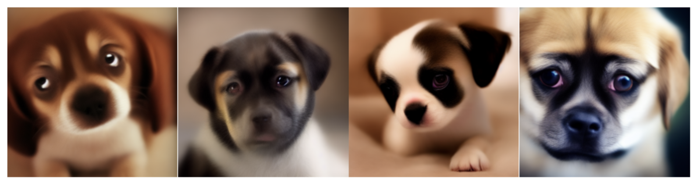
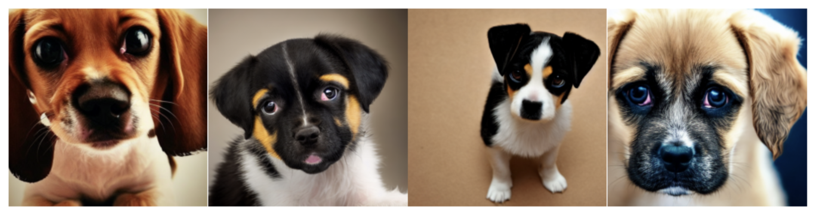
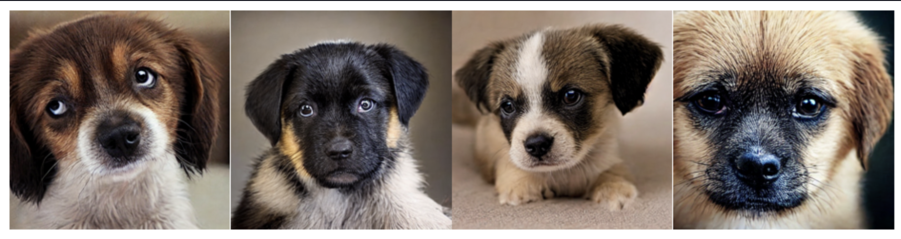

# Consistency Distillation for Stable Diffusion 1.5

### 📌 **Project Overview**

This project explores *Consistency Distillation (CD)* to speed up image generation in [*Stable Diffusion 1.5 (SD1.5)*](https://huggingface.co/stable-diffusion-v1-5/stable-diffusion-v1-5) by reducing the number of diffusion steps while preserving image quality. The goal is to train a student model that can generate high-quality images in just 4 steps instead of the typical 50+.

[Pretrained Model on Hugging Face](evetrubetskaya/consistency_distillation)

### ⚡ **Key Results**

- Successfully distilled *SD1.5* into a 4-step student model

- Achieved significant speedup while maintaining high-quality generations

- Implemented DDIM, self-consistency loss, and boundary conditions for stable training

    <figure>
        
        <figcaption>Before: Standard Diffusion Model (4 steps)</figcaption>
    </figure>
    <figure>
        
        <figcaption>Before: Standard Diffusion Model (50 steps)</figcaption>
    </figure>
    <figure style="margin-top: -1px;">
        
        <figcaption>After: Consistency Model (4 steps)</figcaption>
    </figure>

### 📖 **Motivation and Background**

Traditional diffusion models, such as Stable Diffusion, generate images through an iterative denoising process, requiring numerous steps to progressively refine an image from pure noise. While this approach ensures high-quality outputs, it is computationally expensive and slow, making real-time applications impractical.

Classic samplers like DDPM/DDIM require a large number of steps due to the curvature of the learned trajectory. Reducing the number of solver steps leads to an accumulation of errors, degrading image quality. Consistency Models (CM) address this issue by making the model more robust at each trajectory step, allowing it to select more stable final states and resulting in smoother and more accurate sampling trajectories.

By enforcing self-consistency, we enable image generation with significantly fewer steps. The implemented approach successfully reduces the number of sampling steps from 50 to 4, achieving a ×12-13 inference speedup, which is particularly valuable for efficient diffusion in low-resource environments.

### 🔍 **Methodology**

#### *Diffusion Models & DDIM*

Diffusion models iteratively denoise an image to transform random noise into a meaningful output. The DDIM solver is used to make this process more efficient by reducing the number of inference steps.

#### *Consistency Models (CM)*

Consistency Models learn a mapping that directly predicts a clean image from a noisy input in one step. Instead of iteratively refining an image, they try to learn a direct transformation.

#### *Consistency Distillation (CD)*

In this project, we leverage Consistency Distillation, where a pre-trained diffusion model serves as the teacher to guide the learning of a student Consistency Model (CM), drastically reducing inference time.

### 🛠 **Load the Model and Generate Images**

You can download and run the pretrained consistency model to generate images. Instructions are in [here](instruction.md).

### 📂 **Project Structure**

`сonsistency_models.ipynb` - Jupyter Notebook containing all implementations

`README.md` - this file

`instruction.md` - installation instructions file

### 👩‍💻 **Recommended Reading**

For a deeper understanding of consistency models and diffusion models, consider reading the following papers and articles:

- *Consistency Models – Song et al. (2023) [arXiv](https://arxiv.org/pdf/2303.01469)*

- *Improved techniques for training consistency models  – Song et al. (2023) [arXiv](https://arxiv.org/pdf/2310.14189)*

- *Multistep Consistency Models – Jonathan Heek et al. (2024) [arXiv](https://arxiv.org/pdf/2403.06807)*

- *Elucidating the Design Space of Diffusion-Based Generative Models – Karras et al. (2022) [arXiv](https://arxiv.org/pdf/2206.00364)*

- *Denoising Diffusion Implicit Models (DDIM) – Song et al. (2020) [arXiv](https://arxiv.org/pdf/2010.02502)*

- *Latent Diffusion Models (LDMs) – Rombach et al. (2022) [arXiv](https://arxiv.org/pdf/2112.10752)*

- *Progressive Distillation for Fast Sampling of Diffusion Models – Salimans & Ho (2022) [arXiv](https://arxiv.org/pdf/2202.00512.pdf)*